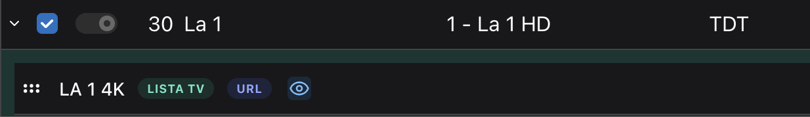

# Dispatcharr

Dispatcharr es una herramienta de gestión y distribución para IPTV que nos permite administrar listas de streams, guías de programación y usuarios para poder enviar una selección de contenido ordenada a nuestros dispositivos.

## Conceptos Importantes a Entender

 - **M3U Accounts (Listas):** Colección de Streams que se obtienen de un proveedor
 - **EPG (Guía de Programación):** Fichero con información sobre los canales que se emiten y sus programas
 - **Channel (Canal):** Un canal es una agrupación de Streams. Tiene un nombre, logo, id que lo relaciona con la EPG (tvg-id), grupo y perfil de stream (Stream Profile)
 -  **Profile (Perfil de Stream):** Modo en el que Dispatcharr gestiona un perfil. Nosotros nos centraremos en dos.
      - **Proxy**: todos los streams pasan por Dispatcharr y todos los clientes se conectan a este "nodo" de forma que un solo stream puede ser repartido entre varios clientes. Además, permite que cuando ocurre "buffering" (se corta el stream), Dispatcharr pueda automáticamente cambiar a la siguiente opción en la lista de streams del canal.
      - **FFMpeg**: cumple la misma función que el Proxy, pero permite un cambio más fluido entre streams cuando hay cortes y habilita transcodificación de video. Es más demandante que el Proxy y requiere una GPU.

## Configurar Lista y Guía de Programación

### Lista M3U

Para configurar las listas, hay que dirigirse a la sección "M3U & EPG Manager" a través del botón que se encuentra en la columna de opciones izquierda. Una vez ahí, a través del botón "Add M3U", añadimos la lista rellenando los siguientes campos:

 - **Name:** Nombre de la lista, a gusto del usuario
 - **URL:** Enlace a la lista. En nuestro caso, con el despliegue por defecto del AceStack, deberá de ser el siguiente: ```http://m3usource:5000/modify_m3u?host=acexy&port=8080&m3u_url=<URL DE LA LISTA>```. Debemos cambiar ```<URL DE LA LISTA>``` por el enlace desde el que obtenemos los streams.
 - **Account Type:** Tipo de lista. En nuestro caso, la guía da soporte para listas .m3u, entonces seleccionaremos ```Standard```.
 - **Refresh Interval (hours):** Frecuencia de actualización de la playlist. Si vamos a utilizar StreamFlow, poner a ```0```para dejar que se encargue.
 - **Stale Stream Retention (days):** Días que mantiene los streams Dispatcharr tras ser eliminados de una playlist. Mi recomendación es ponerlo a ```0``` para no retener streams defectuosos.

El resto de opciones se pueden dejar como están o configurar a gusto del usuario.

### Guía de Programación

Debajo de las listas M3U se encuentra la subsección de las Guías de Programación. Para añadir una, lo hacemos a través del botón "Add EPG" y después "Standard EPG Source". Rellenamos los siguientes campos:

 - **Name:** Nombre de la Guía de Programación (a gusto del usuario).
 - **Source Type:** Tipo de EPG. Seleccionamos ```XMLTV```.
 - **URL:** Enlace a la EPG.

El resto de opciones se pueden dejar como están o configurar a gusto del usuario.

## Configurar Canales

Para crear canales con sus correspondientes streams, hay que dirigirse a la sección "Channels" a través del botón que se encuentra en la columna de opciones izquierda.<br/> Una vez ahí, se puede observar:

 -  **A la izquierda:** la subsección de los canales (vacía si acabamos de configurar Dispatcharr)
 -  **A la derecha:** la subsección de los streams (con streams si hemos configurado con éxito la lista).

El proceso a seguir para crear una canal es el siguiente:

### **1º _Buscamos los streams para añadir al canal_**<br/>
En este caso, voy a utilizar como ejemplo el canal de La 1.<br/>


### **2º _Creamos el canal_**<br/>
Escogemos cualquiera de los streams que queramos incluir en el canal y hacemos click sobre el botón de la cruz verde. Una vez ahí, se nos pregunta sobre el "Number Assignment" (Asignación del nº de canal) y seleccionamos la que más nos convenga (En caso de duda con la primera está bien).

### **3º _Configuramos el canal_**<br/>
Ahora podremos observar que ha aparecido un canal en la sección izquierda de la pantalla. Para editar los detalles, hacemos click en el icono amarillo que se encuentra a la derecha del todo (es posible que haya que desplazarse horizontalmente para llegar a verlo).

Aquí se nos presentan varias opciones a rellenar.

 - **EPG:** recomiendo empezar por aquí. Si este campo está vacío, hacer click en el botón "Auto Match". Si este no se autocompleta, entonces hacer click en el campo y buscar el canal que queremos crear.
 - **Channel Name:** Nombre del canal. A gusto del usuario, personalmente lo nombro igual que aparece en la Guía de Programación.
 - **Stream Profile:** Elegir el modo de stream deseado. Si no tienes GPU, utilizar Proxy. De lo contrario, FFMpeg.

Si el resto de campos no se han rellenado automáticamente al hacer Auto Match, rellenar acorde a como se quiera mostrar en el cliente final. Para guardar los datos, hacer click en "Submit".

### **4º _Añadir streams al canal_**
!!! info
    Si vamos a utilizar Streamflow, este paso es opcional ya que la herramienta se encargará de asignar automáticamente de encontrar los streams en la lista y asignarlos a los canales.

Una vez tengamos creado y configurado el canal, el siguiente paso es asignar streams a este. <br/>
Hacemos click en el botón ">" en la parte izquierda de la tarjeta del canal y se nos desplegará mostrando el primer stream que hemos agregado tal que así:<br/><br/>

<br/>
Dejamos esto así y nos dirigimos a la sección de streams a la derecha. Buscamos los streams correspondientes al canal:
<br/><br/>

<br/><br/>
Para agregar el stream al canal que tenemos actualmente abierto, hacemos click en el botón azul. <br/>
Con este último paso completado, el canal ya está listo para ser utilizado.

## Configurar Usuarios
## Configurar Proxy

